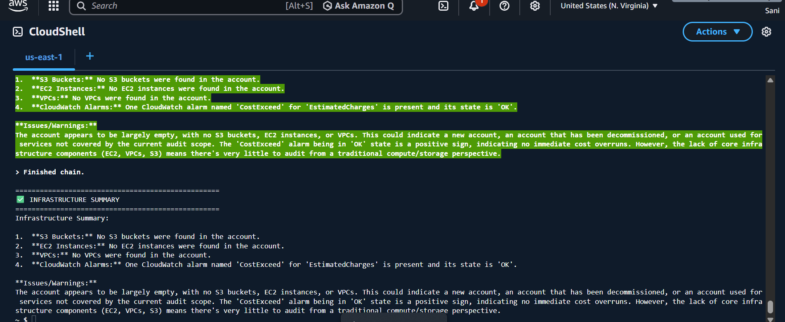
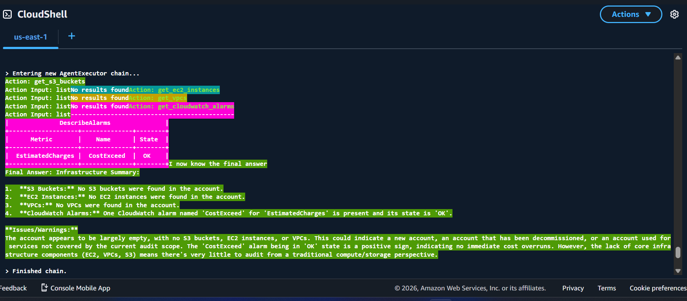

# 🤖 AI DevOps Agent — AWS Infrastructure Auditor


> An AI-powered DevOps agent that autonomously audits AWS infrastructure using the **ReAct (Reason + Act)** loop — built with LangChain, Google Gemini 2.5 Flash, and the AWS CLI. Runs entirely inside AWS CloudShell with zero infrastructure cost.

---

## 📸 Demo

<!-- Replace with your actual screenshots after running the project -->
| Agent Thinking (ReAct Loop) | Final Infrastructure Summary |
|---|---|
|  |  |

---

## 🧠 What This Agent Does

Most DevOps scripts are hardcoded — they check what **you** told them to check. This agent is different.

You give it a **goal**. It figures out the steps itself.

```
Your Goal → Gemini thinks → Picks the right tool → Runs it on AWS
         → Reads output → Thinks again → Picks next tool → Final Answer
```

On each run, the agent:
1. Lists all **S3 buckets**
2. Lists all **EC2 instances** and their states
3. Lists all **VPCs**
4. Checks **IAM users**
5. Scans **Security Groups**
6. Reviews **CloudWatch alarms**
7. Delivers a **full infrastructure summary** with warnings and recommendations — like a senior DevOps engineer reviewing your account

---

## ⚙️ Tech Stack

| Layer | Technology | Role |
|---|---|---|
| **AI Brain** | Google Gemini 2.5 Flash | Reasoning, analysis, recommendations |
| **Agent Framework** | LangChain + ReAct | Orchestrates the think → act → observe loop |
| **Infrastructure** | AWS CLI (via CloudShell) | Real-time data from your AWS account |
| **Runtime** | AWS CloudShell | Zero-setup, free execution environment |
| **Env Management** | python-dotenv | Secure API key handling |
| **Output** | Rich | Clean, readable terminal output |

---

## 🏗️ Architecture

```
┌─────────────────────────────────────────────────────────┐
│                     AWS CloudShell                       │
│                                                         │
│  ┌──────────┐    ┌───────────────────────────────────┐  │
│  │          │    │         ReAct Agent Loop           │  │
│  │  agent.py│───▶│                                   │  │
│  │          │    │  Thought → Action → Observation   │  │
│  └──────────┘    │        (repeats until done)       │  │
│                  └──────────────┬────────────────────┘  │
│                                 │                        │
│           ┌─────────────────────▼──────────────────┐    │
│           │              tools.py                   │    │
│           │  ┌──────────┐  ┌──────────┐            │    │
│           │  │get_s3_   │  │get_ec2_  │  ...6 tools│    │
│           │  │buckets   │  │instances │            │    │
│           │  └────┬─────┘  └────┬─────┘            │    │
│           └───────┼─────────────┼──────────────────┘    │
│                   │             │                        │
└───────────────────┼─────────────┼────────────────────────┘
                    │             │
                    ▼             ▼
          ┌─────────────────────────────┐
          │         AWS APIs             │
          │  S3 · EC2 · VPC · IAM       │
          │  Security Groups · CloudWatch│
          └─────────────────────────────┘
                    │
                    │  (results fed back to)
                    ▼
          ┌─────────────────────────────┐
          │    Google Gemini 2.5 Flash   │
          │  Reasons over real AWS data  │
          │  Applies DevOps best practices│
          │  Flags risks & misconfigs    │
          └─────────────────────────────┘
```

---

## 🚀 Getting Started

### Prerequisites
- AWS account with CloudShell access
- Google account (for Gemini API key — free tier available)
- Basic Python knowledge

### Step 1 — Get Gemini API Key

1. Go to [aistudio.google.com](https://aistudio.google.com)
2. Sign in → **Get API Key** → **Create API key**
3. Copy the key

### Step 2 — Open AWS CloudShell

```
AWS Console → Click the >_ icon (top right) → Wait for it to load
```

### Step 3 — Create Project

```bash
mkdir devops-agent && cd devops-agent
python3 -m venv venv
source venv/bin/activate
```

### Step 4 — Install Packages

```bash
pip install langchain langchain-google-genai langchain-community python-dotenv rich
```

### Step 5 — Set Up Environment Variables

```bash
cat > .env << EOF
GOOGLE_API_KEY=paste_your_key_here
EOF

cat > .gitignore << EOF
.env
venv/
__pycache__/
EOF
```

> ⚠️ Never commit your `.env` file. The `.gitignore` above protects it.

### Step 6 — Add Project Files

Copy `tools.py` and `agent.py` from this repository into your `devops-agent/` folder.

### Step 7 — Test Gemini Connection

```bash
python3 test.py
```

Expected output:
```
✅ Key loaded: AIzaSyXX...hidden
✅ Gemini works: Hello
```

### Step 8 — Run the Agent

```bash
python3 agent.py
```

You'll see the agent reason in real time:

```
> Entering new AgentExecutor chain...
Thought: I need to check S3 buckets first
Action: get_s3_buckets
Observation: 2026-01-15 bucket-name-prod
Thought: Now check EC2 instances...
Action: get_ec2_instances
Observation: i-0301a1e729c3bfe06 | running | t3.micro
...

==================================================
✅ INFRASTRUCTURE SUMMARY
==================================================
Found 1 S3 bucket and 1 running EC2 instance.
⚠️  Warning: No CloudWatch alarms configured — EC2 is unmonitored.
⚠️  Warning: Running EC2 with no VPC found — verify network config.
✅  IAM: 1 user found, creation date appears recent.
Recommendation: Set up CloudWatch alarms for EC2 CPU/memory...
```

---

## 📁 Project Structure

```
devops-agent/
├── .env              ← API key (never commit — protected by .gitignore)
├── .gitignore        ← Excludes secrets and venv
├── test.py           ← Verifies Gemini connection before running agent
├── tools.py          ← The agent's hands — 6 AWS tools it can use
├── agent.py          ← The agent's brain — ReAct reasoning loop
└── venv/             ← Isolated Python environment (not committed)
```

---

## 🔧 The 6 AWS Tools

| Tool | What It Does |
|---|---|
| `get_s3_buckets` | Lists all S3 buckets in the account |
| `get_ec2_instances` | Lists EC2 instances with state and type |
| `get_vpcs` | Lists all VPCs with CIDR and default flag |
| `get_iam_users` | Lists IAM users with creation date |
| `get_security_groups` | Lists security groups with VPC association |
| `get_cloudwatch_alarms` | Lists CloudWatch alarms and their states |

---

## 🔁 How the ReAct Loop Works

```
Traditional Script          AI Agent (This Project)
─────────────────           ───────────────────────
You write all logic    →    You write the goal
if no_alarms:               Gemini figures out the logic
  print("warning")          It applies DevOps knowledge from training
                            It handles scenarios you didn't think of
```

ReAct = **Re**ason + **Act**

```
Goal → Think → Pick Tool → Run Tool → Read Output → Think Again → Repeat → Final Answer
```

The agent stops when it has enough information to write a complete answer — or when it hits the `max_iterations` limit (set to 8 in `agent.py`).

---

## 💡 Key Engineering Decisions

**Why CloudShell?**
- Zero infrastructure to manage — spins up in seconds
- Pre-authenticated AWS access — no credential setup
- Free to use — no EC2, no Lambda, no cost

**Why Gemini 2.5 Flash?**
- Free tier supports 10 requests/minute — enough for this agent
- Strong reasoning on infrastructure analysis tasks
- `gemini-2.5-flash` is the verified working model string as of 2025

**Why LangChain ReAct?**
- `hwchase17/react` is the standard ReAct prompt from LangChain Hub
- `AgentExecutor` handles the loop, error recovery, and tool routing automatically
- Easily extensible — add new tools with just the `@tool` decorator

---

## 🛠️ Troubleshooting

| Error | Fix |
|---|---|
| `ModuleNotFoundError` | Run `source venv/bin/activate` |
| `API key invalid` | Check key in `.env` file |
| `Rate limit hit` | Wait 60 seconds — free tier is 10 RPM |
| `Unable to locate credentials` | Run `aws sts get-caller-identity` to verify CloudShell access |
| `model not found` | Use exactly `gemini-2.5-flash` as the model string |

---

## 🔒 Cost & Cleanup

**This project is designed to be free:**
- AWS CloudShell — free
- Google Gemini API — free tier (15 RPM, 1M tokens/day)
- No EC2, no Lambda, no persistent resources created

**After completing the project:**
- No AWS resources to delete — CloudShell leaves no billable footprint
- Optionally delete the CloudShell files: `rm -rf ~/devops-agent`
- Check Google Cloud Console → APIs & Services → Gemini API usage if concerned

---

## 📈 What I Learned

- How AI agents differ from traditional automation scripts
- The ReAct (Reason + Act) loop pattern and why it enables flexible problem-solving
- How LangChain's `@tool` decorator and `AgentExecutor` work under the hood
- Practical prompt design — the quality of the agent's goal directly determines output quality
- How to handle AWS CLI subprocess output safely in Python (filtering CloudShell gRPC noise)
- The role of a DevOps engineer in an AI-powered workflow: tool builder, goal designer, safety gatekeeper

---

## 🗺️ What's Next (Day 2+)

- [ ] Add write-capable tools (restart EC2, create alarms) with human approval gates
- [ ] Build a cost optimization agent using AWS Cost Explorer API
- [ ] Create a multi-agent system with an orchestrator agent
- [ ] Add Slack/email alerting for the infrastructure summary
- [ ] Deploy as a scheduled Lambda function for daily audits

---

## 🤝 Acknowledgements

Built following the [AI DevOps series](https://github.com/Tech-With-Sandesh/Ai-DevOps) — learning AI agent patterns applied to real DevOps workflows.

---

## 📄 License

MIT License — feel free to use, modify, and build on this.